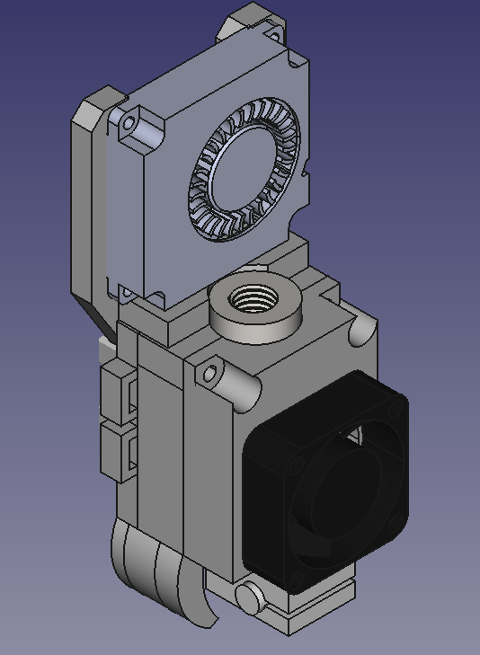
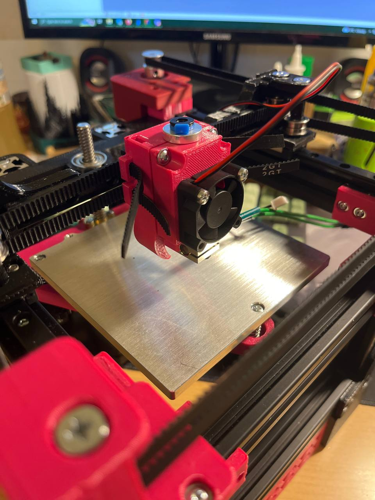

# Warhead

Tiniest possible bowden toolhead with built in part cooling and gt2 belt loops. 
Built specifically for Rudy, but will work on any other 3D printer that has a 
forward facing mgn9c carriage for X axis (Rook, Salad fork, etc.)

## BOM

 - warhead_back.stl
 - warhead_front.stl
 - 3010 fan
 - 4010 radial fan
 - bowden V6 hotend
 - M3 x 8 metric screw x 2
 - M3 x 12-16 metric screw x 2
 - M3 x 6 metric screw x 4