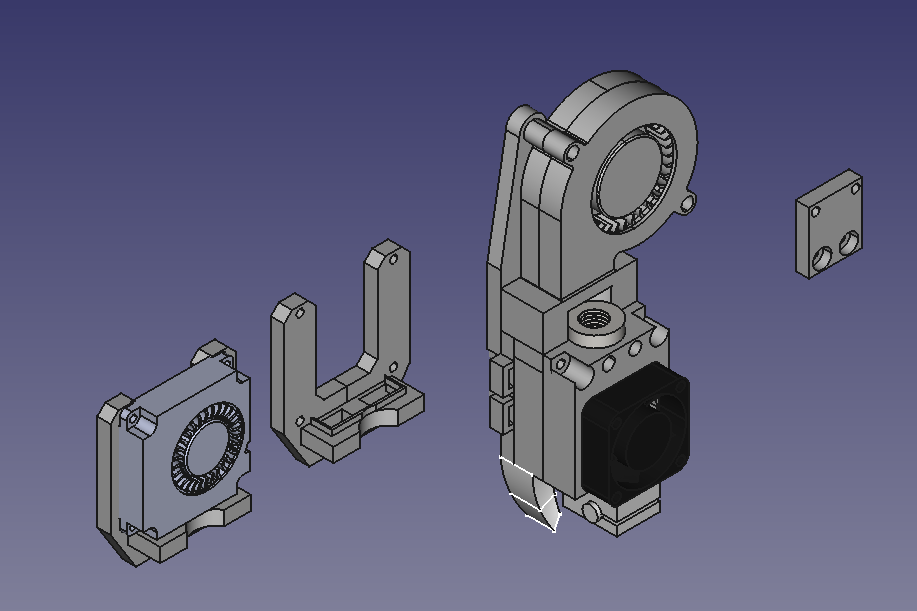
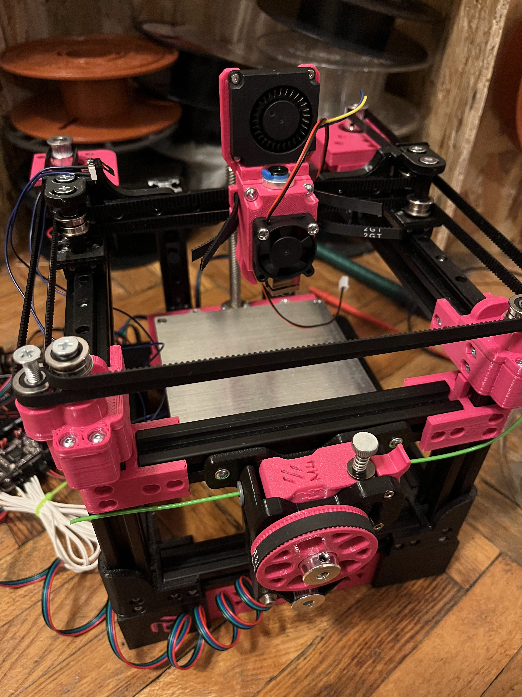

# Warhead

Tiniest possible bowden toolhead with built in part cooling and gt2 belt loops. 
Built specifically for Rudy, but will work on any other 3D printer that has a 
forward facing mgn9c carriage for X axis (Rook, Salad fork, etc.)

You can mount mods if they have two 3mm holes spaced 10mm from each other.
The repo includes mounts for a 4010 radial fan, a 5015 blower fan and an
ADXL345 sensor.

## BOM

 - 3010 fan
 - bowden V6 compatible hotend
 - M3 x 8 metric screw x 2
 - M3 x 12-16 metric screw x 2
 - M3 x 6 metric screw x 4